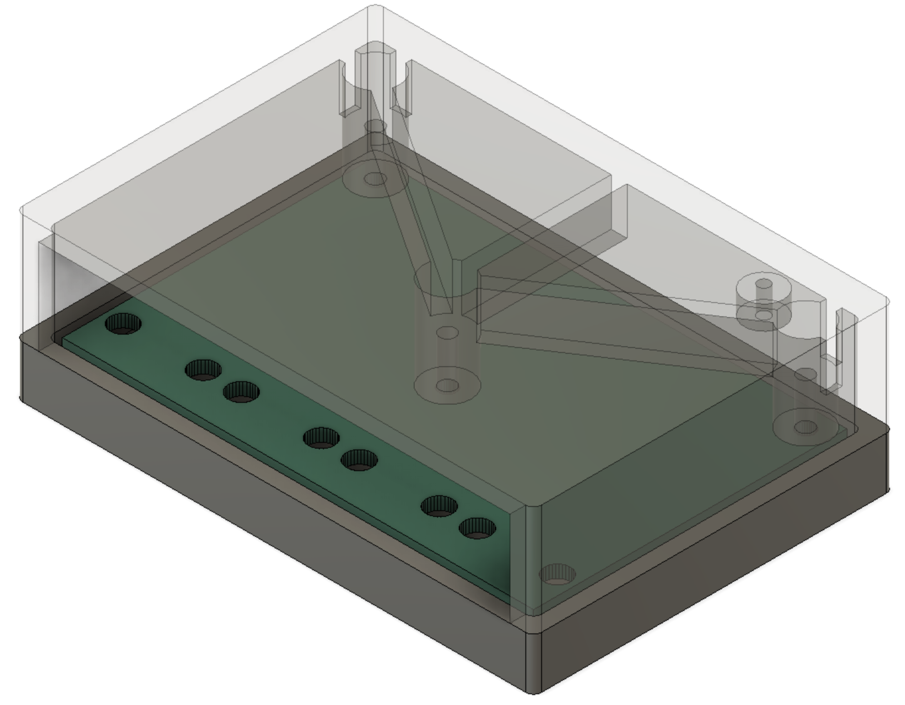

# DSMR Splitter

## Pictures

## Dimensions
The case measures approximately 67 x 45 x 20 mm.

## Print Settings
Print both parts in PETG at 0.2 mm layer height with 20% infill. Both parts can
be clamped together with M3x10 mm or M3x15 mm self-tappening screws.
