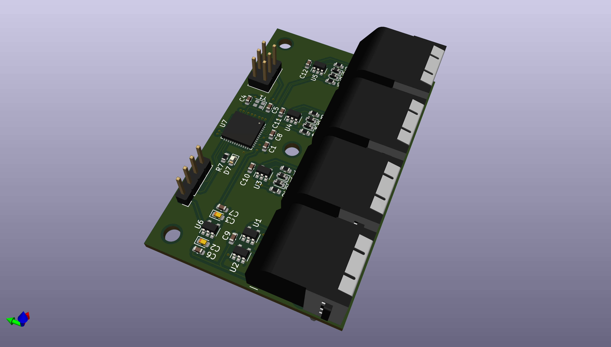
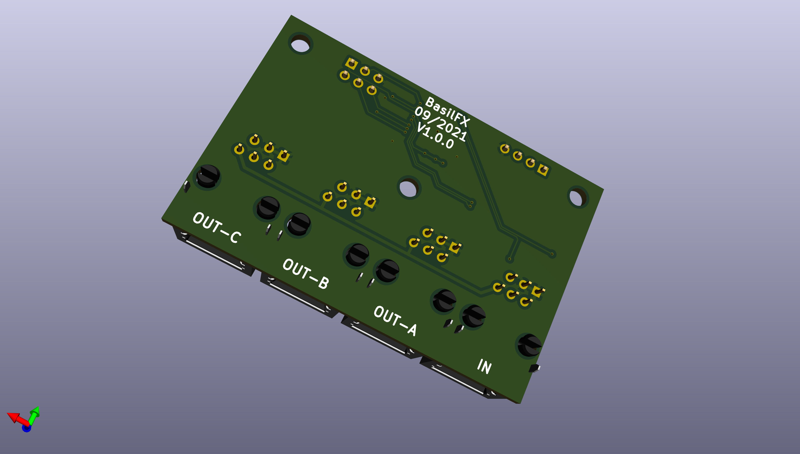

# DSMR Splitter
Active port expander for the P1 port on a Dutch Smart Meter (DSMR).

## Introduction
This is an active port expander for DSMR 5.0. Contrary to simple splitting
cables, this exapander buffers telegrams, and provides a dedicated port to
connected devices.

### Advantages

This design solves two (potential) issues compared to other splitters:

* Some port splitters have a primary and a secondary port. Only the primary
  port has the data-request line connected to the DSMR. This means that the
  secondary port cannot request telegrams on its own and depends on the device
  connected to the master port
* A device connected to the slave port could receive out-of-sync, if it depends
  on the data-request line. This could lead to incomplete/corrupt telegrams.

See [this](docs/Problem-statement.md) for more information.

## Features
* 3-port splitter.
* DSMR 5.0.
* No external power supply needed.

The splitter does not provide galvanic isolation between ports. Furthemore, it
requires a DSMR 5.0 meter because it provides 5 V power. Do note that the power
(5 V, 250 mA) provided by the DSMR has to be shared among all readers.

Older DSMR versions can be supported by changing the firmware and providing 5 V
externally.

## Contents
* The `3d/` folder contains a 3D-printable design for an enclosure.
* The `firmware/` folder contains the RIOT-OS firmware used for the
  microcontroller.
* The `pcb/` folder contains the Kicad schema and board design.

## License
The work in this repository is covered by CC BY-NC-SA 4.0. See the `LICENSE.md`
file for more information.
