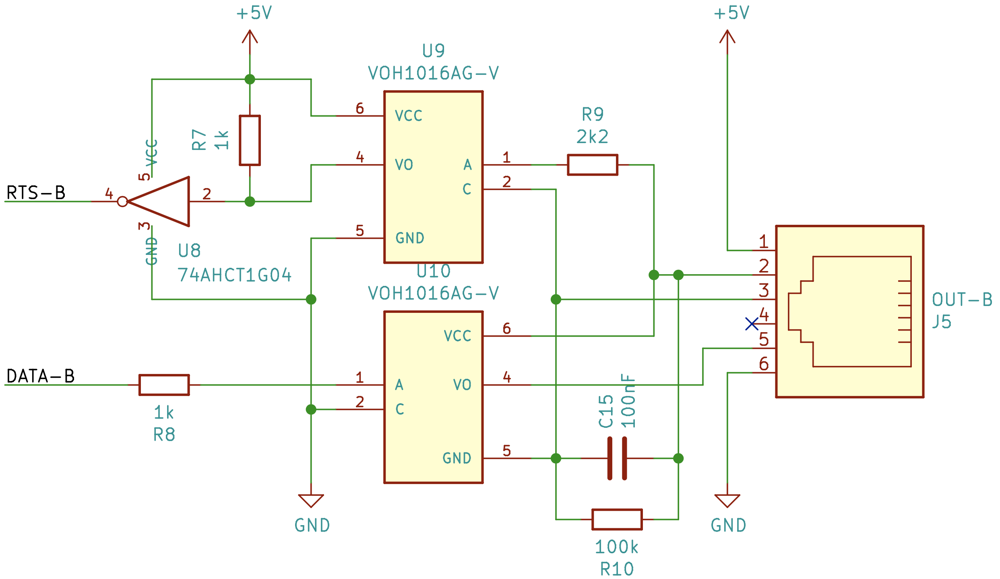

# Isolation

## Introduction
All of the three ports are galvanic isolated using optocouplers, unless the
ports are connected to devices that require 5 V power supply. In that case,
the input 5 V would be connected to the output devices.

Note that optocouplers generally provide much greater galvanic isolation (order
of kilovolts). However, the distance between the pins of the RJ12 connectors is
much smaller than the distance between the input and output pins of the
optocuoplers.

## Optocoupler
To achieve the high baud rate of 115200, a high-speed optocoupler is used. This
optocoupler required 5 V, but that is not available on the output side. To make
this work, the data-request line is used as a power supply: according to the
DSMR 5.0 specification, it must be able to source 10 mA at 5 V, and it must be
toggled high before any data is transmitted.

The Vishay VOH1016A optocoupler was selected after careful testing. Its power
consumption is approximately 5 mA, which is less than the maximum of 10 mA. The
schematic below shows the schematic for one of the three output ports.

