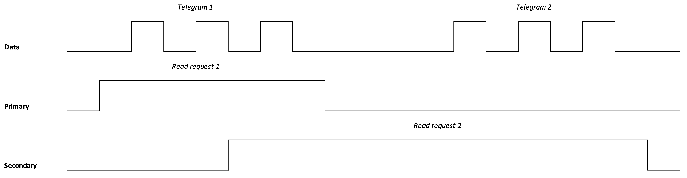

# Problem statement

## Introduction
Given two or more readers that are connected to the DSMR. Both readers have
their own data-request line, but the data output is shared.

If the secondary port starts reading by toggling the read request while the
primary is still busy, the secondary will read an incomplete and invalid
telegram. Furthermore, it has to wait ~1 second before the second telegram is
outputted by the DSMR.

If the secondary port did not have the data-request line connected, it would
not been able to read a complete and valid telegram.